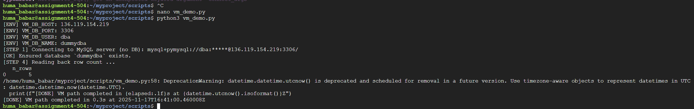
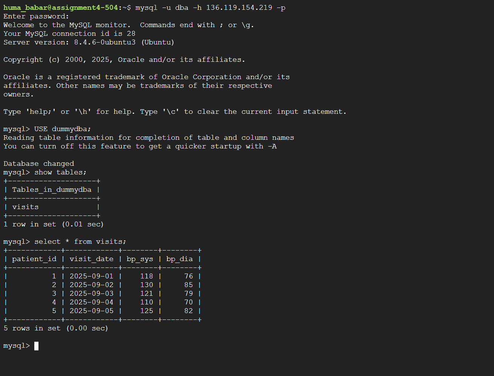
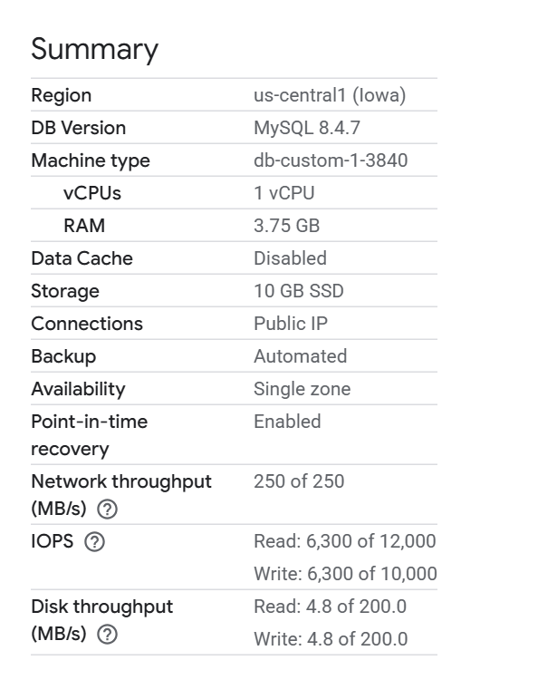
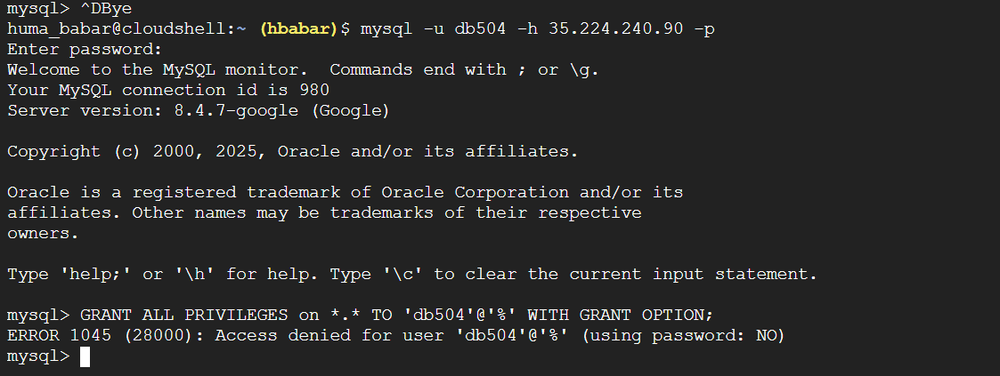

# Summary of steps
I used Google Cloud Platform (GCP) to provision two MySQL databases. 
- Video Link: [Assignment 4 Recording](https://drive.google.com/file/d/1XeEGKox9RbxQeHFgL5Ek90shCXiQ6tBb/view?usp=sharing)
## GCP: Compute Engine
### Step 1: Create VM 
- VM Name: `assignment4-504`
- Region/zone: `us-central1-f` 
- Machine type: `e2-micro`
- Allow: Port 22 and Port 3306 (I created this in the firewall rules)

### Step 2: Install MySQL on my VM and make project
- Opened the `SSH` for my vm and ran: `sudo apt-get update` and `sudo apt install mysql-server mysql-client -y`
- I created a folder structure: **myproject/scripts/**

### Step 3: Change binding address
- Change binding address to `0.0.0.0`

### Step 4: Restart my SQL 
- Ran the following command: `sudo systemctl daemon-reload`

### Step 5: Created DBA user and dummydba database
`GRANT ALL PRIVILEGES ON *.* TO 'dba'@'%' WITH GRANT OPTION` and `create database dummydba` 

### Step 6: Run Script 
- I used the command `nano vm_demo.py` to copy paste my script from the vs code file: vm_demo.py. 
- I then did `python3 vm_demo.py` 

### Step 7: Show Table
- I then did `mysql -u dba -p` and entered my password. I did:
    - `USE dummydba` 
    - `show tables`
    - `select * from visits` to see my table 

## GCP: Cloud SQL for MySQL
### Step 1: Creating Cloud SQL Instance
    - Cloud SQL edition: Enterprise 
    - Database version: MySQL 8.4
    - Instance ID: assignment4-504
    - Region: us-central1 (Iowa) and single zone
    - 1 vCPU, 3.75 GB
    - Storage: 10GB

### Step 2: Create user and grant permissions
- I then created a user db504 and opened up Google cloud shell to connect to mysql:
`mysql -u db504 -h 35.224.240.90 -p` 
- I then tried to grant user db504 permission with the command `GRANT ALL PRIVILEGES on *.* TO 'db504'@'%' WITH GRANT OPTION` however this did not work.  

### Step 3: Run Script
- I then created the `init.sql` file and edited my script which helped me run my code by creating the visits in my database. 
- I ran the command: `python scripts/managed_demo.py` 

